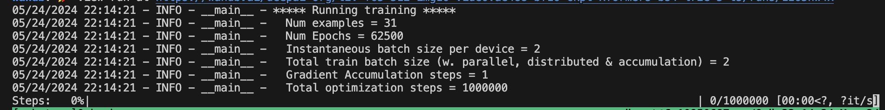

# OpenSoraTraining - Finetuning OpenSoraPlan
A hacker's guide to training Open Sora Plan on your custom dataset and GPUs.

### Setting up Vast for training

To SSH into a Vast.ai instance, you need to follow these general steps:

1) Generate and add your SSH key to Vast

The command bellow will generate an SSH key and store it in the ```~/.ssh``` with your desired filename.

```
ssh-keygen -t rsa -b 4096 -C "your_email@example.com" -f ~/.ssh/<your_filename>.pem
```

When you ls into ```~/.ssh```  you will see the private and public key ```.pem``` and ```.pem.pub``` respectively.
Now go to the Vast dashboard and add your ssh key. Copy ur ssh key with the command and add your ssh key to vast:

```
pbcopy < ~/.ssh/your_file.pem.pub
```

2) Pay hommage to Vast

Go to the [billing](https://cloud.vast.ai/billing/), input your credit card info, get some free credits blah blah.

3) Creating a template on Vast

On Vast.ai, a template is a pre-configured environment that includes specific software and settings needed for a particular task. 

Templates can include (saves time):

Specific versions of software (e.g., PyTorch, TensorFlow).
Runtime environments with specific libraries and dependencies.
Custom settings and configurations tailored to certain workflows or applications.

Since you're working with a machine learning model, the "Pytorch 2.2.0 Cuda12.1 Devel" template or any other PyTorch template with the appropriate CUDA support should be suitable. These templates will have the necessary libraries pre-installed and allow you to set up your environment without Docker.


3) Renting out GPUs

Now let's [find a GPU](https://cloud.vast.ai/) to rent out! 
When training a video generation model we're looking for something like somewhere in the 80gb of memory range. Most of the GPUs from the past 5 years (A100s, Tesla GPUs, H100s they all work well just a matter of speed).


4) Your instance is running! SSH now!

Go click on the "Open SSH Interface" button and click on the Add SSH Key. Now your SSH key is added to the instance,
and you can SSH in!


```
ssh -i ~/.ssh/your_file.pem -p <port_number> root@<instance_up> -L 8080:localhost:8080
```

Wait a minute and then enter your paraphrase...

## Open-Sora-Plan-RR Edition (Raccoon Research)

1) Please star and fork this repo: https://github.com/eric-prog/Open-Sora-Plan-RR

2) Then clone your fork of Open-Sora-Plan-RR into your Vast instance

```
git clone https://github.com/eric-prog/Open-Sora-Plan-RR.git
```

if you do ls you will see Open-Sora-Plan is indeed in your directory. Now ```cd Open-Sora-Plan```

3) Install Open Sora Plan packages

Make sure you have [conda](https://www.anaconda.com/download) installed.
```
conda --version
```

Then install required packages in this order:
```
cd Open-Sora-Plan-RR
conda create -n opensora python=3.8 -y
conda activate opensora OR source activate opensora
pip install -e .
```

Install additional packages for training cases:
```
pip install -e ".[train]"
pip install flash-attn --no-build-isolation
```

Make sure we have git lfs installed. Git lsf is an extension to git and it's used to handle large files more efficiently.
```
sudo apt install git-lfs
git lfs install
```

### Training Open-Sora-Plan

Let's setup the pretrained model. 

1) Download the t2v pretrained model using the custom download script

```
python3 scripts/download_t2v.py
```

When you ```ls``` you will notice you can't see it because it's stored in cache. Run this command:
```
cp /root/.cache/huggingface/hub/models--maxin-cn--Latte/snapshots/<...>/t2v.pt ./t2v.pt
```


2) Download the vae

```
mkdir vae

python3 scripts/download_vae.py

# after installation
cp /root.cache/huggingface/hub/models--LanguageBind--Open-Sora-Plan-v1.0.0/snapshots/<...>/vae/* vae
```


3) Edit hyperparams in the ```scripts/text_condition/train_videoae_65x512x512.sh```

You have downloaded everything.

We're going to use the t2v.pt file as our pretrain model. These are the initial weights of the diffusion model which helps in starting the training from an already trained model state.

Our ae path will be the Open-Sora-Plan-RR/vae which contains the config.json and the tensor file containing the weights for the vae.

Changes shown below are already configured in the [repo](https://github.com/eric-prog/Open-Sora-Plan-RR/blob/main/scripts/text_condition/train_videoae_65x512x512.sh), just showing it bellow.

```
export WANDB_KEY=""
export ENTITY=""
export PROJECT="t2v-f65-256-img16-videovae488-bf16-ckpt-xformers-bs4-lr2e-5-t5"
accelerate launch \
    --config_file scripts/accelerate_configs/deepspeed_zero2_config.yaml \
    opensora/train/train_t2v.py \
    --model LatteT2V-XL/122 \
    --text_encoder_name DeepFloyd/t5-v1_1-xxl \
    --dataset t2v \
    --ae CausalVAEModel_4x8x8 \
    --ae_path /root/Open-Sora-Plan-RR/vae \
    --data_path "./videos/captions.json" \
    --video_folder "./videos" \
    --sample_rate 1 \
    --num_frames 65 \
    --max_image_size 512 \
    --gradient_checkpointing \
    --attention_mode xformers \
    --train_batch_size=2 \
    --dataloader_num_workers 10 \
    --gradient_accumulation_steps=1 \
    --max_train_steps=1000000 \
    --learning_rate=2e-05 \
    --lr_scheduler="constant" \
    --lr_warmup_steps=0 \
    --mixed_precision="bf16" \
    --checkpointing_steps=1 \
    --output_dir="t2v-f65-512-img16-videovae488-bf16-ckpt-xformers-bs4-lr2e-5-t5" \
    --allow_tf32 \
    --pretrained "/root/Open-Sora-Plan-RR/t2v.pt" \
    --use_deepspeed \
    --model_max_length 300 \
    --use_image_num 16 \
    --use_img_from_vid \
    --enable_tiling
```

4) Let's make our videos folder for the dataset.

```
cd Open-Sora-Plan
mkdir videos
```


5) Use scp to transfer it to the Vast.ai instance

The command bellow will transfer all .mp4 files into the videos directory in your Vast instance.

```
scp -i ~/.ssh/your_private.pem -P <port> ./renders/*.mp4 root@<instance_ip>:/root/Open-Sora-Plan-RR/videos/
```


Generate captions for your videos (Simian specific)
```
python3 scripts/combinations_to_captions.py --json_file combinations.json --video_folder renders
```

Add that to the videos folder too (MAKE SURE THE PATHS MATCH WHAT'S ON YOUR VAST INSTANCE):
```
scp -i ~/.ssh/your_private.pem -P <port> ./captions.json root@<instance_ip>:/root/Open-Sora-Plan-RR/videos/
```

Note this is what my captions.json file looks like!

```
[
  {
    "path": "./videos/0.mp4",
    "cap": [
      "..."
    ]
  },
  {
    "path": "./videos/1.mp4",
    "cap": [
      "..."
    ]
  },
  {
    "path": "./videos/2.mp4",
    "cap": [
      "..."
    ]
  }
  ...
]
```

### Train and then stop!

1) You heard me right. Run the training below but then stop it after a bit because we only wanted to train using the ```t2v.pt``` to initialize the model's parameters and generate gradients for further finetuning. Get your API key from [wandb](https://wandb.ai/home)

```
WANDB_KEY=your_key bash scripts/text_condition/train_videoae_65x512x512.sh
```



Beautiful isn't it.

2) Wait a bit and then cancel it once it gets to like 5/100000, or when you see checkpoint-1 up until checkpoint-2 in the terminal (YOU MUST GET THIS checkpoints). generated just to be safe and then quit. Use checkpoint-1 (but you will know what I'm talking about later on).

3) Edit hyperparams again in the ```scripts/text_condition/train_videoae_65x512x512.sh``` (you will have to push and pull).

```
export WANDB_KEY=""
export ENTITY=""
export PROJECT="t2v-f65-256-img16-videovae488-bf16-ckpt-xformers-bs4-lr2e-5-t5"
accelerate launch \
    --config_file scripts/accelerate_configs/deepspeed_zero2_config.yaml \
    opensora/train/train_t2v.py \
    --model LatteT2V-XL/122 \
    --text_encoder_name DeepFloyd/t5-v1_1-xxl \
    --dataset t2v \
    --ae CausalVAEModel_4x8x8 \
    --ae_path /root/Open-Sora-Plan-RR/vae \
    --data_path "./videos/captions.json" \
    --video_folder "./videos" \
    --sample_rate 1 \
    --num_frames 65 \
    --max_image_size 512 \
    --gradient_checkpointing \
    --attention_mode xformers \
    --train_batch_size=1 \
    --dataloader_num_workers 10 \
    --gradient_accumulation_steps=1 \
    --max_train_steps=1000000 \
    --learning_rate=2e-05 \
    --lr_scheduler="constant" \
    --lr_warmup_steps=0 \
    --mixed_precision="bf16" \
    --report_to="wandb" \
    --checkpointing_steps=500 \
    --output_dir="t2v-f65-512-img16-videovae488-bf16-ckpt-xformers-bs4-lr2e-5-t5" \
    --allow_tf32 \
    --resume_from_checkpoint "/root/Open-Sora-Plan-RR/t2v-f65-512-img16-videovae488-bf16-ckpt-xformers-bs4-lr2e-5-t5/checkpoint-1" \
    --use_deepspeed \
    --model_max_length 300 \
    --use_image_num 16 \
    --use_img_from_vid \
    --enable_tiling
```


<br> 


## FINALLY FINETUNE

Now let's train, fr.

```
WANDB_KEY=<your_key> bash scripts/text_condition/train_videoae_65x512x512.sh
```